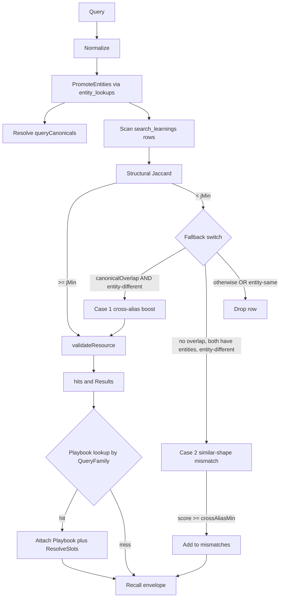

# feat: Backport ESPN learn-loop evolutions into prediction-goat

**Target repo:** `mvanhorn/printing-press-library` (this repo)
**Target branch:** `feat/prediction-goat` (PR #780, "feat(prediction-goat): add prediction-goat")
**All paths below are repo-relative**, rooted at `library/payments/prediction-goat/`.

---

## Summary

Carry ESPN's learn-loop evolutions (PR #851 cascade: plans 003, 004, 005, 007, 008 plus four rounds of Greptile-driven bug-class fixes) into prediction-goat. ESPN diverged forward of prediction-goat by adding cross-alias canonical resolution, similar-shape mismatch surfacing, a self-learning playbook primitive with hand-authored choreography and free-text gotchas, embed-FS auto-install of seed content, and a series of recall correctness guards that Greptile identified during PR #851 review.

prediction-goat today carries an older shape of the learn loop: `search_learnings` table, basic structural Jaccard, a "recipes" generalization layer (auto-extracted query/resource templates), and `teach` / `teach-lookup` / `teach-recipe` user commands. It has no cross-alias resolution, no playbook primitive, no schema-reconcile heal path, and predates the Greptile-found recall correctness fixes.

---

## Problem Frame

ESPN dogfood (7 sessions, 6/6 positive, 2 amend-fired) validated that the learn-loop cascade collapses 3-5 cold-path tool calls down to 1-2 when recall hits, and that the playbook surface delivers measurable agent-experience improvement (cross-entity replay, surfaced gotchas, agent self-correction via `playbook amend`). The same primitives apply directly to prediction-goat: high-volume Polymarket / Kalshi market lookups have repeating shapes (odds-for-team, market-for-event, series-summary-for-tournament) where a canonical playbook plus cross-alias resolution would deliver the same compression.

The Greptile-driven bug fixes (case-1 / case-2 same-entity guards on the cross-alias fallback, atomic notes append, sentinel filter, slot-pool restriction, schema migration `rows.Err()` checks, partial-update CASE semantics in upsert) are correctness improvements that any user of the underlying primitives needs. Porting them now keeps prediction-goat and ESPN structurally aligned and avoids the divergence cost of re-deriving them later.

---

## Requirements

- **R1.** prediction-goat's recall path supports cross-alias canonical resolution: a query with one alias for an entity ("USA") hits a stored learning that used a different alias ("United States") via `entity_lookups` canonical resolution.
- **R2.** Recall surfaces a `similar_shape_different_entity` warning when query structure matches a stored row but the entities resolve to different canonicals — replacing the misleading `no_learnings_for_query_family` envelope warning.
- **R3.** prediction-goat ships a `learning_playbooks` primitive: structured JSON choreography (steps, entity_slots, expected_tool_calls) plus free-text notes per query family, attached to the recall envelope when the family matches.
- **R4.** Agent-facing `teach-playbook`, `playbook amend`, `playbook list` commands let users and agents author and amend playbooks at runtime.
- **R5.** Auto-install: hand-authored playbook content (JSON + notes) is embedded into the prediction-goat binary via `embed.FS` and seeded into `learning_playbooks` on first DB open. SeedVersion bumps re-seed corrected content for existing installs without losing agent-authored amends.
- **R6.** Schema reconciliation: on Open, the store reflectively checks `PRAGMA table_info` and `ALTER TABLE ADD COLUMN` to heal pre-existing user DBs that predate the new tables / columns.
- **R7.** All recall correctness fixes Greptile surfaced on PR #851 are present: case-1 and case-2 `entitySlicesIntersect` guards on the cross-alias fallback, case-insensitive comparison in the helper, atomic `AppendPlaybookNotes` for race-free amend, `ListPlaybooks` hides `__`-prefixed sentinel families, `ResolveSlots` candidate pool restricted to entities, `rows.Err()` checks on the canonical-resolve and pragma-columns paths, partial-update CASE semantics so blank fields in upsert input do not wipe existing data, `[amend ` marker detection so re-seed preserves agent-authored notes.
- **R8.** prediction-goat ships 2-3 hand-authored playbooks covering known repeat-query shapes (e.g. "odds for $TEAM in $TOURNAMENT", "$EVENT markets", "series summary for $SERIES"). Selection happens during U10 once recall traffic is dogfooded.
- **R9.** Hand-authored playbooks coexist with the existing `recipes` generalization layer without semantic confusion. Recipes (auto-extracted templates) and playbooks (hand-authored choreography + notes) are distinct concepts with distinct tables and commands.
- **R10.** The published prediction-goat passes the catalog repo's verify gates: `verify-skills`, `verify-supply-chain`, `Govulncheck`, Greptile policy gate.

---

## Scope Boundaries

### In scope

- Code: `library/payments/prediction-goat/internal/learn/`, `library/payments/prediction-goat/internal/store/`, `library/payments/prediction-goat/internal/cli/`, `library/payments/prediction-goat/SKILL.md`
- New embedded content: `library/payments/prediction-goat/internal/cli/playbooks/` (analogous to ESPN's directory)
- Tests for every new file, ported from ESPN's coverage
- Dogfood validation against real recall traffic before declaring complete

### Deferred to Follow-Up Work

- Cross-CLI generator template port: updating `cli-printing-press/internal/generator/templates/internal/learn/` so future fresh prints carry these features. Worth doing but a separate plan — touches a different repo and has its own verify gates.
- Backporting to all other published CLIs that ship the older learn loop (kalshi, hubspot-pp-cli, contact-goat, etc.). Each CLI may have local divergences worth respecting; do these one at a time after prediction-goat validates the shape.
- prediction-goat's own dogfood-gaps work tracked in `docs/plans/2026-05-22-001-fix-prediction-goat-dogfood-gaps-plan.md` — coordinate sequencing if both plans want to land in PR #780.

### Out of scope (does not match this product's identity)

- Replacing prediction-goat's `recipes` (auto-extracted generalization templates) with ESPN's `patterns` naming. Recipes is a working, distinct concept; renaming would touch every import for cosmetic gain. Plan keeps prediction-goat's existing names.
- Replacing the recipes layer with playbooks. They serve different purposes (auto-extract vs hand-author) and the recipes machinery is already shipping.

---

## Key Technical Decisions

1. **Recipes and playbooks coexist as separate concepts.** prediction-goat's existing `internal/learn/recipes/` package stays exactly as it is. Playbooks land in a new `internal/learn/playbooks.go` plus `internal/store/playbooks.go` and `internal/cli/playbooks/` embed directory, distinct from `recipes/`. The recall envelope surfaces both: recipes can still rewrite a query into a resource template via the existing apply path; playbooks attach choreography + notes via the new path.
2. **Land on PR #780, not after merge.** PR #780 is the open "add prediction-goat" PR with 24 commits ahead. Adding the backport as additional commits on `feat/prediction-goat` is cheaper than waiting and avoids merge-conflict surface from new prediction-goat work that lands in parallel.
3. **Port from current ESPN HEAD (`9bb0a40a`), not from older plan-numbered commits.** ESPN's PR #851 evolved across 5 plan files plus 4 Greptile rounds; the current HEAD carries the canonical version of every fix. Reference plan-numbered commits only for explanatory comments.
4. **Hand-port directly into prediction-goat, not via the generator.** Per the catalog repo's AGENTS.md: "A broken published CLI gets patched here first, regardless of root cause." The generator template update goes to a follow-on plan in `cli-printing-press`.
5. **Catalog `.printing-press-patches.json` entry.** Every modified file outside generator output gets recorded in `library/payments/prediction-goat/.printing-press-patches.json` per the catalog convention, so a future fresh print knows what was customized.
6. **No rename: `recipes/` stays.** ESPN renamed `recipes/` → `patterns/` at some point; prediction-goat keeps `recipes/`. ESPN-style improvements to the *contents* of that package (multi-entity stripping in `queryStructural`, `anyMulti` guard in `buildQueryTemplate`) port to prediction-goat's `recipes/extract.go`.

---

## High-Level Technical Design

*This illustrates the intended approach and is directional guidance for review, not implementation specification. The implementing agent should treat it as context, not code to reproduce.*



Two new packages plus one extension:

- `internal/learn/playbooks.go` — Playbook / PlaybookStep / ResolvedPlaybook types, `ParsePlaybook`, `MarshalPlaybook`, `QueryFamily`, `ResolveSlots`. Mirror ESPN's playbooks.go shape.
- `internal/store/playbooks.go` — `UpsertPlaybook` (partial-update CASE semantics, PreserveExistingNotes flag), `AppendPlaybookNotes` (atomic under writeMu), `GetPlaybookByFamily`, `ListPlaybooks` (hides `__`-prefixed sentinel families). Mirror ESPN's playbooks.go shape.
- `internal/cli/playbooks/` — embed.FS for hand-authored JSON+notes pairs plus MANIFEST.md plus embed.go carrying SeedVersion.
- `internal/cli/playbook_init.go` — sync.Once gated install path; `[amend ` marker detection drives PreserveExistingNotes; sentinel-row gates re-seed.
- `internal/cli/teach_playbook.go` — `teach-playbook`, `playbook list`, `playbook amend` commands.
- `internal/learn/recall.go` — extend with PromoteEntities call, CanonicalResolver use, the cross-alias fallback switch with both `entitySlicesIntersect` guards, similar-shape mismatch surfacing, playbook lookup at envelope build time.
- `internal/learn/promote.go` — new file. PromoteEntities helper used at both teach time and recall time.
- `internal/learn/recall.go` plus `internal/learn/recipes/extract.go` — multi-entity generalization (drop queryEntities[0] assumption, add anyMulti guard).
- `internal/store/store.go` — schema reconcile (PRAGMA table_info + ALTER TABLE) with `rows.Err()` checks on every iteration; new `learning_playbooks` and `entity_lookups` table CREATE.

---

## Output Structure

```text
library/payments/prediction-goat/
  internal/
    learn/
      playbooks.go                          (new)
      playbooks_test.go                     (new)
      promote.go                            (new)
      promote_test.go                       (new)
      recall.go                             (modify)
      recall_canonical_test.go              (new)
      recipes/
        extract.go                          (modify: multi-entity generalization)
        extract_test.go                     (modify)
    store/
      playbooks.go                          (new)
      playbooks_test.go                     (new)
      store.go                              (modify: schema reconcile)
      learnings.go                          (modify: PromoteEntities at teach time)
    cli/
      playbook_init.go                      (new)
      playbook_init_test.go                 (new)
      teach_playbook.go                     (new)
      teach_playbook_test.go                (new)
      playbooks/
        embed.go                            (new)
        MANIFEST.md                         (new)
        odds_for_team.json                  (new, U10)
        odds_for_team_notes.md              (new, U10)
        event_markets.json                  (new, U10)
        event_markets_notes.md              (new, U10)
        series_summary.json                 (new, U10)
        series_summary_notes.md             (new, U10)
      root.go                               (modify: wire new commands)
  SKILL.md                                  (modify: decision tree extension)
  .printing-press-patches.json              (modify: record customizations)
```

---

## Implementation Units

### U1. Schema reconcile + `entity_lookups` table

**Goal:** prediction-goat's store layer gains the reflective schema-heal pattern and the `entity_lookups` table that backs cross-alias resolution.

**Requirements:** R1, R6.

**Dependencies:** none.

**Files:**

- `internal/store/store.go` (modify): add `learning_playbooks` and `entity_lookups` CREATE TABLE statements; add `reconcileSchema` that walks `PRAGMA table_info` and applies `ALTER TABLE ADD COLUMN` for any missing columns. Check `rows.Err()` after every iteration so a mid-loop DB error doesn't silently produce a partial column map.
- `internal/store/store_test.go` (modify or add): legacy-DB heal test (open a DB pre-created without the new tables, confirm Open creates them).

**Approach:** Mirror ESPN's `internal/store/store.go` reconcile path. The pattern is: on Open, after CREATE TABLE IF NOT EXISTS for every known table, walk each table's PRAGMA columns vs. the desired column set and emit ALTER TABLE for missing ones. Critical: per Greptile round 2, `canonRows.Err()` and `pragmaColumns.Err()` must be checked after `rows.Next()` returns false so a transient sqlite error doesn't drive a spurious ALTER. Use ESPN's `partitionCreateTableStatements` plus the per-table desired-column maps as the reference shape.

**Patterns to follow:** ESPN `library/media-and-entertainment/espn/internal/store/store.go` reconcileSchema function. prediction-goat already has schema version tests (`schema_version_test.go`, 52KB) — extend those rather than starting a fresh test file.

**Test scenarios:**

- Happy path: fresh DB, Open creates `learning_playbooks`, `entity_lookups`, and existing tables.
- Edge case: pre-existing DB created with the old schema (no `learning_playbooks`, no `entity_lookups`). Open should add the missing tables without dropping data from `search_learnings` / `search_recipes`.
- Edge case: pre-existing DB where `search_learnings.query_entities` column is missing. Open should ALTER TABLE ADD COLUMN it without data loss.
- Error path: `PRAGMA table_info` returns rows then errors mid-iteration. `reconcileSchema` should return the error, not produce a partial column map. (Cover via injected DB or table-scoped test.)

**Verification:** existing `schema_version_test.go` suite passes plus new legacy-heal tests pass. `go vet ./...` clean. No regression in any existing store test.

---

### U2. `PromoteEntities` + `CanonicalResolver` primitive

**Goal:** Add the symmetric teach/recall entity-promotion helper and the canonical resolver, so a token that resolves through `entity_lookups` ends up in `normalized.Entities` rather than `normalized.NonEntityNormalized` regardless of where it was originally classified by the extractor.

**Requirements:** R1.

**Dependencies:** U1.

**Files:**

- `internal/learn/promote.go` (new)
- `internal/learn/promote_test.go` (new)
- `internal/learn/recall.go` (modify): instantiate `CanonicalResolver` once per `Recall()` call, call `PromoteEntities(normalized, resolver)` before computing query tokens / canonicals.
- `internal/store/learnings.go` (modify): in `Upsert` / equivalent teach-time path, call `PromoteEntities` before persisting `query_entities` so stored rows are symmetric with recall-time normalization. Also opportunistic backfill for legacy null-entity rows at recall time (read-only walk through `query_pattern` tokens via the resolver).
- `internal/learn/normalize.go` (modify if needed): expose `NormalizedQuery.Entities` slice mutation API.

**Approach:** Port ESPN's `promote.go` verbatim, adapting the import paths. CanonicalResolver wraps a DB handle and exposes `Resolve(tok) ([]string, error)` (returns canonicals) and `ResolveSet([]string) map[string]struct{}`. Critical from Greptile rounds 2-3: scan errors and `rows.Err()` after iteration must NOT cache partial canonical lists — subsequent `Resolve()` calls retry rather than returning a truncated cached slice.

**Patterns to follow:** ESPN `library/media-and-entertainment/espn/internal/learn/promote.go`, ESPN `recall.go` lines ~700+ for `CanonicalResolver`.

**Test scenarios:**

- Covers R1. Happy path: token in `entity_lookups` gets promoted from `NonEntityNormalized` to `Entities`.
- Edge case: token not in `entity_lookups` — no promotion, no error.
- Edge case: empty query — no-op, returns the input unchanged.
- Error path: DB error during resolve — error surfaces, no partial cache poison. Two sequential `Resolve()` calls after an error both retry (the second call must not return the first call's partial result).
- Integration: teach-then-recall round-trip — teach a row with "Niners" promoted, recall with "49ers" still hits (cross-alias).

**Verification:** new tests green; legacy null-entity rows opportunistically resolve in recall without being rewritten on disk (read-only contract).

---

### U3. Cross-alias recall fallback + similar-shape mismatch surfacing

**Goal:** Extend `Recall()` with the cross-alias fallback switch. Carry over EVERY Greptile-found correctness fix from ESPN's PR #851 review rounds 2-4.

**Requirements:** R1, R2, R7.

**Dependencies:** U2.

**Files:**

- `internal/learn/recall.go` (modify): add `setIntersects`, `entitySlicesIntersect` (case-insensitive helper), `canonicalJaccard` helpers. Restructure the post-Jaccard branch into the three-case switch (canonicalOverlap with entity-different guard, similar-shape mismatch with entity-different guard, default-drop). Add the `similar_shape_different_entity` envelope warning when mismatches exist. Add ambiguous_alias warning that fires only when a SINGLE query entity resolves to multiple canonicals (per Greptile round 2 - the union check overfires on ordinary multi-entity queries).
- `internal/learn/recall_canonical_test.go` (new): port ESPN's full canonical-recall test suite (cross-alias hits, similar-shape mismatch surfacing, ambiguous-alias firing only on single-entity multi-canonical, case-1 same-entity guard, case-2 same-entity guard, case-insensitive comparison).

**Approach:** This is the densest port. Read ESPN's `recall.go` switch block at the corresponding spot (around line 345 in current HEAD `9bb0a40a`), copy structure verbatim into prediction-goat's `recall.go`, adapt for prediction-goat's `normalize.go` / `store.NormalizeQuery` shape. Critical: both case 1 (canonicalOverlap) and case 2 (similar-shape) must have the `entitySlicesIntersect` guard fire BEFORE the score boost or floor check — without it, same-literal-entity rows whose structural Jaccard is below jMin slip through via canonical boost (1.0) or the lower crossAliasMin floor. The `entitySlicesIntersect` helper compares case-insensitively because `normalized.Entities` is lowercased but stored entities preserve extractor casing.

**Patterns to follow:** ESPN `library/media-and-entertainment/espn/internal/learn/recall.go` lines 280-380, plus `entitySlicesIntersect` / `setIntersects` / `canonicalJaccard` helpers around line 700.

**Test scenarios:** (port from ESPN's recall_canonical_test.go verbatim, adapted for prediction-goat's seedCanonical helpers)

- Covers R1. Cross-alias hit: query "United States odds" hits stored row taught with "USA odds" when entity_lookups maps both to the same canonical.
- Covers R1. Cross-alias hit promotes EntityMatch from Mismatch to Exact + emits `cross_alias_match` warning on the result.
- Covers R2. Different canonicals do NOT promote to Results, surface `similar_shape_different_entity` envelope warning instead of `no_learnings_for_query_family`.
- Covers R7. Case 1 same-entity guard: stored "Mariners today scoreboard" vs query "Mariners end of year stats" — structural Jaccard 0.0, both canonicals = Seattle Mariners, canonicalJaccard would boost to 1.0 without the guard. Must drop.
- Covers R7. Case 2 same-entity guard: stored "Mariners A doing season" vs query "Mariners B doing year" with no entity_lookups entry for Mariners — structural Jaccard in (crossAliasMin, jMin), case-2 floor would admit. Must drop.
- Covers R7. Case-insensitive entitySlicesIntersect: stored entities `["Mariners"]` (extractor casing) vs `normalized.Entities = ["mariners"]` (lowercased) — guard must fire.
- Covers R7. Ambiguous-alias warning fires when a SINGLE query entity ("Cards") resolves to multiple canonicals (Arizona Cardinals + St. Louis Cardinals), does NOT fire on ordinary multi-entity queries ("49ers vs Cowboys").
- Edge case: empty entity_lookups — falls back to literal entity match without erroring (entity-only fallback at the top of the < jMin branch).
- Edge case: legacy null-entity row (query_entities = NULL) — opportunistic backfill via resolver walks the lowercased query_pattern tokens.

**Verification:** every ESPN canonical-recall test passes against prediction-goat's recall.go. Score 5/5 worthy of Greptile.

---

### U4. Multi-entity generalization in recipes

**Goal:** prediction-goat's `recipes/extract.go` no longer assumes a single-entity query at template inference time. `queryStructural` strips all entity tokens (not just queryEntities[0]); `buildQueryTemplate` honors that; multi-entity rows still excluded from inferred-template inference via an `anyMulti` guard.

**Requirements:** R7 (the patterns improvement Greptile round 4 confirmed correct).

**Dependencies:** U2.

**Files:**

- `internal/learn/recipes/extract.go` (modify): generalize `queryStructural` and `buildQueryTemplate` to take an entity slice. Add `anyMulti` guard.
- `internal/learn/recipes/extract_test.go` (modify): port ESPN's multi-entity pattern tests.

**Approach:** ESPN's commit pattern (Plan 004 U4 in commit history) shows the diff: prior implementation took only `queryEntities[0]`; new implementation iterates the full entity slice. The `anyMulti` guard ensures rows whose entity count exceeds 1 are excluded from pattern inference (those go to the recipes-substitute path with the multi-arg apply pattern, not the structural-template path).

**Patterns to follow:** ESPN `library/media-and-entertainment/espn/internal/learn/patterns/extract.go`. (Note ESPN renamed `recipes/` to `patterns/` — prediction-goat keeps `recipes/` per Decision 6.)

**Test scenarios:**

- Happy path: two single-entity teaches with the same structure produce a template that the third single-entity query in the same shape matches.
- Edge case: a multi-entity row (e.g., "$HOME vs $AWAY tonight") is excluded from inferred templates via `anyMulti` so it doesn't pollute a single-slot template.
- Regression: prediction-goat's existing recipe tests stay green — `recipes/extract_test.go`, `recipes/generalization_test.go`.

**Verification:** `recipes` package tests + new multi-entity tests pass.

---

### U5. `learning_playbooks` store layer

**Goal:** Add the new `playbooks.go` store file with `UpsertPlaybook`, `AppendPlaybookNotes`, `GetPlaybookByFamily`, `ListPlaybooks`.

**Requirements:** R3, R7.

**Dependencies:** U1.

**Files:**

- `internal/store/playbooks.go` (new)
- `internal/store/playbooks_test.go` (new)

**Approach:** Port ESPN's `internal/store/playbooks.go` verbatim with import-path adaptation. Carry over EVERY correctness improvement from PR #851:

- `UpsertPlaybook` uses CASE WHEN partial-update semantics so blank `PlaybookJSON` or `NotesText` in the input doesn't wipe stored data.
- `PreserveExistingNotes` flag for the seed-loop affordance.
- `AppendPlaybookNotes` does read+update atomically inside a single transaction under writeMu — no race-overwrite under concurrent `playbook amend &` background calls.
- `ListPlaybooks` filters `WHERE query_family NOT LIKE '\_\_%' ESCAPE '\'` so sentinel rows (`__seed_meta__`) stay out of agent-facing listings.
- `GetPlaybookByFamily` continues to resolve any family including the sentinel — needed by the install path's version check.

**Patterns to follow:** ESPN `library/media-and-entertainment/espn/internal/store/playbooks.go` HEAD `9bb0a40a`.

**Test scenarios:**

- Covers R3. Happy path: Upsert inserts new row; second Upsert with new content updates not inserts.
- Covers R7. Upsert with empty NotesText leaves stored notes_text intact (partial-update CASE).
- Covers R7. AppendPlaybookNotes appends correctly to existing notes; creates a notes-only row when no row exists (leading newlines trimmed on insert).
- Covers R7. Concurrent AppendPlaybookNotes (8 goroutines): all 8 markers present in final notes_text, none lost to race. (Mirrors ESPN's TestAppendPlaybookNotes_ConcurrentNoLoss.)
- Covers R7. ListPlaybooks hides `__seed_meta__` and any other `__`-prefixed sentinels; GetPlaybookByFamily resolves them.
- Edge case: empty QueryFamily on Upsert → error.
- Edge case: both PlaybookJSON and NotesText empty on Upsert → error.

**Verification:** all tests pass; `go test ./internal/store/ -race ./...` clean.

---

### U6. Playbook types + slot resolution

**Goal:** Add the in-process Playbook types and `ResolveSlots` for entity-slot binding at recall time.

**Requirements:** R3, R7.

**Dependencies:** U2, U5.

**Files:**

- `internal/learn/playbooks.go` (new)
- `internal/learn/playbooks_test.go` (new)

**Approach:** Port ESPN's `internal/learn/playbooks.go` verbatim. Critical from Greptile round 4: `ResolveSlots` candidate pool is restricted to `normalized.Entities` only (NOT the union with NonEntityNormalized tokens) — a non-entity token that coincidentally resolves through entity_lookups must not steal a slot intended for a real entity.

**Patterns to follow:** ESPN `library/media-and-entertainment/espn/internal/learn/playbooks.go` HEAD `9bb0a40a`. Types: `Playbook`, `PlaybookStep`, `ResolvedPlaybook`. Functions: `ParsePlaybook`, `MarshalPlaybook`, `QueryFamily`, `ResolveSlots`.

**Test scenarios:**

- Covers R3. Happy path: single-entity playbook with `$TEAM` slot binds correctly when query has one entity that resolves.
- Covers R3. Multi-entity playbook with `$HOME` / `$AWAY` slots binds both in playbook-declared order.
- Covers R7. Non-entity token aliased in entity_lookups does NOT win a slot intended for a real entity. (Hand-build a NormalizedQuery where the non-entity token resolves; verify the real entity wins the binding.)
- Edge case: unresolvable slot — slot stays absent from the map.
- Edge case: nil resolver — returns nil.
- Edge case: empty entity_slots — returns nil.
- JSON round-trip: ParsePlaybook → MarshalPlaybook returns equivalent struct (field-by-field).

**Verification:** all tests pass.

---

### U7. Recall envelope playbook surface

**Goal:** Recall envelope attaches a `playbook` (ResolvedPlaybook) and `notes` (string) when the query family matches a stored playbook.

**Requirements:** R3.

**Dependencies:** U3, U5, U6.

**Files:**

- `internal/learn/recall.go` (modify): after sortHits, look up `store.GetPlaybookByFamily(QueryFamily(normalized))`. If hit, attach `ResolvedPlaybook` (with ResolveSlots output) and `notes_text` to the recall envelope.
- `internal/learn/recall.go` envelope type (likely in same file): add `Playbook *ResolvedPlaybook`, `Notes string` fields.
- `internal/cli/search.go` (or wherever recall is consumed): if the envelope carries a playbook, surface it in the agent-mode JSON output.
- `internal/learn/recall_canonical_test.go` (modify): add playbook-surface tests.

**Approach:** ESPN's recall envelope already does this in the same path. Mirror it. The lookup is cheap (single SELECT by query_family) and fails gracefully (no playbook → envelope is unchanged).

**Patterns to follow:** ESPN `library/media-and-entertainment/espn/internal/learn/recall.go` envelope-build section at the end of Recall().

**Test scenarios:**

- Covers R3. Family match: query whose `QueryFamily` matches a seeded playbook → envelope carries Playbook + Notes.
- Covers R3. Different-entity same-family: query about Team B whose family matches a playbook taught against Team A → envelope still carries the playbook (slot binding picks Team B's canonical).
- No match: envelope.Playbook is nil, no error.
- Notes-only row (no JSON): envelope carries Notes string but Playbook is nil.

**Verification:** new playbook-envelope tests pass; existing recall tests still pass.

---

### U8. `teach-playbook`, `playbook amend`, `playbook list` commands

**Goal:** Three user-facing commands that author and amend playbooks at runtime, plus `playbook list` for inspection.

**Requirements:** R4.

**Dependencies:** U5, U6.

**Files:**

- `internal/cli/teach_playbook.go` (new): wires the three subcommands.
- `internal/cli/teach_playbook_test.go` (new)
- `internal/cli/root.go` (modify): register `newPlaybookCmd(flags, learnCfg)` so the subcommands are reachable from the root.

**Approach:** Port ESPN's `teach_playbook.go` verbatim, adapt import paths and noLearnEnvVar. Critical: `playbook amend` uses `store.AppendPlaybookNotes(family, marker)` not `GetPlaybookByFamily` + `UpsertPlaybook`. Fire-and-forget posture (silent on success, errors to teach.log, safe to background with `&`) so agents can amend during routine work without surfacing failures.

**Patterns to follow:** ESPN `library/media-and-entertainment/espn/internal/cli/teach_playbook.go`. prediction-goat already has `teach.go`, `teach_lookup.go`, `teach_recipe.go` — follow that style (rootFlags pointer + per-cmd handler + audit log append at the end).

**Test scenarios:**

- Covers R4. Happy path: `teach-playbook --query "$Q" --playbook-file <path>` inserts a row in `learning_playbooks`.
- Covers R4. `playbook amend --query "$Q" --add-note "..."` appends a timestamped marker to the matching family's notes_text. (Run the family-derivation through Normalize + PromoteEntities + QueryFamily to confirm match.)
- Covers R4. `playbook list` returns all non-sentinel rows.
- Covers R7. `playbook amend` on a family that doesn't exist creates a notes-only row.
- Covers R7. `playbook amend --no-learn` is a no-op.
- Edge case: empty --query or empty --add-note → silent code error, no stdout output.
- Audit log: every command appends a structured row to the audit log (action=playbook-teach / playbook-amend).

**Verification:** all command tests pass; manual `go run` smoke tests confirm the three subcommands exist and produce expected JSON in agent mode.

---

### U9. Embed-FS auto-install for hand-authored playbooks

**Goal:** Hand-authored playbook JSON+notes pairs in `internal/cli/playbooks/` get embedded into the binary and seeded into `learning_playbooks` on first DB open. SeedVersion bumps re-seed only when stored notes lack a `[amend ` marker, so agent-authored amends survive binary upgrades.

**Requirements:** R5.

**Dependencies:** U5, U8.

**Files:**

- `internal/cli/playbooks/embed.go` (new): `//go:embed *.json *.md` plus `SeedVersion` constant.
- `internal/cli/playbooks/MANIFEST.md` (new): minimal so the embed pattern works even with zero playbook content.
- `internal/cli/playbook_init.go` (new): the install path.
- `internal/cli/playbook_init_test.go` (new)
- `internal/cli/root.go` (modify): wire `runPlaybookInitOnce(ctx)` into `PersistentPreRunE` after the learn init.

**Approach:** Port ESPN's `playbook_init.go` verbatim. The install flow:

1. Sync.Once gated.
2. Read sentinel row `__seed_meta__`. If notes_text matches `SeedVersion`, no-op.
3. Walk `playbooks.FS`. For each `<base>.json` (and optional `<base>_notes.md`), parse the JSON, derive ALL distinct query families via `QueryFamily(Normalize(example))` for each `query_family_examples` entry, and Upsert under each family.
4. Critical (Greptile round 2): before each Upsert, check the existing row's notes. If notes_text contains `[amend ` marker, pass `PreserveExistingNotes: true` so the agent's amend survives. Otherwise overwrite (so a SeedVersion bump actually ships corrected notes content).
5. Write sentinel row last with `notes_text = SeedVersion`.

Greptile round 4 surfaced 4 hygiene findings on this file — apply all of them in the port:

- Use the passed `ctx` (don't `_ = ctx` it).
- `[amend ` heuristic: consider whether prediction-goat's playbook notes will ever legitimately contain that literal string in body content. If yes, switch to a more-specific marker (e.g. `\n[amend 2`) or scan with a regex.
- Don't write sentinel if any per-playbook upsert failed (return early with the error).
- `pragmaColumns` PRAGMA statement uses parameterized table name, not string concatenation.

**Patterns to follow:** ESPN `library/media-and-entertainment/espn/internal/cli/playbook_init.go` HEAD `9bb0a40a`, plus the 4 hygiene fixes from Greptile round 4 review.

**Test scenarios:**

- Covers R5. Fresh DB: install seeds every JSON file's family + notes.
- Covers R5. Idempotent: running installPlaybooksFromEmbed twice produces zero drift.
- Covers R5. SeedVersion bump + no amend marker: notes content overwritten.
- Covers R5. SeedVersion bump + `[amend ...]` marker: notes preserved.
- Covers R7. Concurrent install (5 goroutines): exactly one sentinel row, no duplicate playbook rows.
- Edge case: a playbook JSON with no `query_family_examples` is skipped with a stderr warning (filename-stem fallback was unreachable at recall time, so refuse to seed under an unreachable key — Greptile round 2 finding).
- Failure path: if any playbook upsert fails mid-loop, sentinel does NOT update (so next install retries) — Greptile round 4 finding.

**Verification:** all install tests pass; fresh `$HOME` real-binary check shows seeded playbooks appear in `playbook list`.

---

### U10. Hand-authored playbooks for known prediction-goat query shapes

**Goal:** Ship 2-3 hand-authored playbooks covering the highest-value repeat-query shapes in prediction-goat.

**Requirements:** R8.

**Dependencies:** U9.

**Files:**

- `internal/cli/playbooks/odds_for_team.json` (new)
- `internal/cli/playbooks/odds_for_team_notes.md` (new)
- `internal/cli/playbooks/event_markets.json` (new)
- `internal/cli/playbooks/event_markets_notes.md` (new)
- `internal/cli/playbooks/series_summary.json` (new)
- `internal/cli/playbooks/series_summary_notes.md` (new)

**Approach:** Authored in collaboration with the user during execution — these are content decisions, not code decisions. The selection should match what prediction-goat dogfood has already shown to be high-value (the user's prior dogfood-gaps work in `2026-05-22-001-fix-prediction-goat-dogfood-gaps-plan.md` is a likely source). Each playbook needs:

- 3+ `query_family_examples` covering the shape.
- `steps`: structured tool-call choreography (use `espn-pp-cli`-style cmd patterns adapted to `prediction-goat`'s actual command shape — likely `markets`, `events`, `series-summary`).
- `entity_slots`: at least `$TEAM` / `$EVENT` / `$SERIES` depending on shape.
- `expected_tool_calls`: the cold-path number this playbook collapses (typically 3-5 → 1-2).
- A companion `_notes.md` with the gotchas (endpoint envelope shapes, pagination, undocumented status values) that dogfood surfaced for that shape.

**Patterns to follow:** ESPN's 4 hand-authored playbooks in `library/media-and-entertainment/espn/internal/cli/playbooks/` show the shape. The `_notes.md` files include real dogfood-discovered gotchas (DNP signal mismatch, byathlete nesting, --select silent no-op) — prediction-goat's notes should similarly capture its observed real gotchas.

**Test scenarios:**

- Covers R8. Each playbook parses cleanly (`learn.ParsePlaybook` returns no error).
- Covers R8. Each playbook's `query_family_examples` normalize to non-empty families.
- Covers R8. Real-binary dogfood: invoke `prediction-goat recall "<example query>"` for each shape, confirm envelope carries the right playbook.

**Verification:** dogfood pass on at least 2 query shapes per playbook in a fresh `$HOME` shows the playbook attached to the recall envelope and the agent (or a manual reader) can execute the choreography to a correct answer.

---

### U11. SKILL.md decision-tree extension + audit log entries

**Goal:** SKILL.md tells the agent about the playbook decision branch: when recall returns a playbook, follow the choreography. When the agent discovers a correction worth persisting, fire `playbook amend` in the background.

**Requirements:** R4.

**Dependencies:** U7, U8, U10.

**Files:**

- `SKILL.md` (modify): extend the existing decision tree. Add the "Step 6: if recall returned a playbook, follow the steps; if your debug-protocol identifies a concrete correction, fire `playbook amend &`" branch.
- `library/payments/prediction-goat/.printing-press-patches.json` (modify): record the customization per catalog convention.

**Approach:** Mirror ESPN's SKILL.md extension. The exact text should reference prediction-goat commands (`prediction-goat search ...` instead of `espn-pp-cli search ...`).

**Patterns to follow:** ESPN `library/media-and-entertainment/espn/SKILL.md` decision-tree section, plus the catalog repo's `verify-skills.yml` flag-allowlist conventions.

**Test scenarios:** Test expectation: minimal -- this is documentation, not behavior-bearing code. The verify-skills CI check will catch any flag references that don't exist in `internal/cli/*.go`.

**Verification:** `verify-skills.yml` passes locally via `python3 .github/scripts/verify-skill/verify_skill.py --dir library/payments/prediction-goat/`.

---

### U12. Real-binary dogfood + retrospective

**Goal:** Validate the full backport against real recall traffic on prediction-goat, capture findings, decide whether to ship to PR #780 or stage in a follow-on PR.

**Requirements:** R10.

**Dependencies:** U1 through U11.

**Files:**

- `library/payments/prediction-goat/dogfood-results.json` (modify): append the new validation pass.
- `library/payments/prediction-goat/.printing-press-patches.json` (modify): finalize the patch entries.
- `docs/decisions/2026-05-NN-prediction-goat-learn-loop-backport-findings.md` (new): retrospective with the cold-path → warm-path measurements ESPN's plan 008 used as its template.

**Approach:** Run the full ESPN dogfood protocol against prediction-goat:

1. Fresh `$HOME`, install latest prediction-goat binary.
2. 5-7 distinct queries spanning the 2-3 hand-authored playbook shapes plus 2-3 cold-path shapes (no playbook expected).
3. Measure: tool-call count, did recall fire pre-discovery, did the envelope carry a playbook, did the playbook slot resolve, did the agent fire `playbook amend` with any correction.
4. Look for: similar-shape mismatch surfacing, ambiguous-alias firing only on legit single-entity ambiguity, no case-1/case-2 same-entity leaks into Results.
5. Retrospective: net-positive vs. cold path; concrete amends fired; bugs surfaced.

**Patterns to follow:** ESPN plan 008 retrospective in `docs/decisions/2026-05-25-008-espn-goat-findings.md` (or wherever ESPN's retrospective landed).

**Test scenarios:** This unit is the validation gate, not a feature. Test expectation: dogfood pass shows ≥4/5 positive sessions and at least one amend-fire across the run.

**Verification:** retrospective committed; `dogfood-results.json` updated; user decision on whether to land on PR #780 or open follow-on PR.

---

## Execution Posture

Most units have a clear before/after shape and good ESPN reference code, so default execution posture is fine.

**Test-first for U3** (cross-alias recall fallback): the Greptile-found bugs in ESPN's PR #851 round 2-4 each had a clean reproducing test. Write that test first against prediction-goat's recall, watch it fail, then port the fix. Catches any prediction-goat-specific divergence in normalization / canonical resolution that ESPN's tests don't cover.

**Characterization-first for U4** (recipes multi-entity generalization): prediction-goat's `recipes/extract.go` already has tests covering the existing single-entity behavior. Lock those in characterization-style before changing `queryStructural` so the multi-entity additions don't regress single-entity recipes.

---

## System-Wide Impact

- **End users:** prediction-goat's search command gets meaningfully smarter via cross-alias resolution + playbook envelope. No breaking change to existing teach/recall/recipe behavior.
- **Operators / publish flow:** PR #780 grows by ~25-30 commits. Adds new tables (`learning_playbooks`, `entity_lookups`) — the schema reconcile heal path means existing user DBs upgrade in place on next Open.
- **Other CLIs in catalog:** This work is a precedent for backporting the same evolutions to other older-learn-loop CLIs (kalshi, hubspot-pp-cli, contact-goat). Out of scope for this plan but easier to do after this one validates the shape.
- **Generator (`cli-printing-press`):** Diverges from prediction-goat after this lands. A follow-on plan in `cli-printing-press` should port the templates so future fresh prints carry the new shape.

---

## Risks & Mitigations

- **PR #780 conflicts with new prediction-goat work.** Other commits may land on `feat/prediction-goat` while this plan executes. Mitigation: rebase frequently; commit per-unit; keep the unit set narrow enough that a rebase is mechanical.
- **prediction-goat's `recipes` and the new playbooks could confuse users.** They serve different purposes but the words are close. Mitigation: SKILL.md (U11) explicitly disambiguates. `playbook list` and `recipe list` are distinct surfaces.
- **`[amend ` marker false positives** — Greptile round 4 flagged that user-authored notes content could contain the literal string. Mitigation: U9 uses a more-specific marker shape (`\n[amend 2026-` regex anchor) or scans only the suffix.
- **Schema reconcile drift across CLIs.** prediction-goat's heal path may diverge from ESPN's. Mitigation: keep heal path mechanically copy-able and document both at the top of their respective `store.go` files so future CLIs can adopt the same shape.
- **Dogfood traffic is thin** if prediction-goat isn't being used heavily. Mitigation: the 2026-05-22 dogfood-gaps plan may have already surfaced repeat-query shapes worth seeding; coordinate.

---

## Deferred to Implementation

- Exact prediction-goat command names for playbook step `cmd:` fields (likely `prediction-goat search`, `prediction-goat events get-by-slug`, etc. — confirm at U10 time).
- Whether to extend the `playbook list` JSON output with any prediction-goat-specific fields beyond ESPN's shape.
- The 2-3 playbook shapes for U10 — picked based on dogfood evidence at execution time, not at plan time.
- Whether U12's retrospective should be committed inside `printing-press-library` (this repo, plans-gitignored convention) or `printing-press` (local working library).

---

## Open Questions

- **Land on PR #780 or open a separate stacked PR?** Decision proposed in §Key Technical Decisions: land on PR #780. Confirm with user before pushing to that branch.
- **Coordinate with the 2026-05-22-001 dogfood-gaps plan?** If that plan is mid-execution on the same branch, sequence the two so they don't conflict. Quick read of the plan during U1 to confirm.

---

## References

- ESPN PR #851 (`mvanhorn/printing-press-library`): the source-of-truth for this backport. HEAD `9bb0a40a` carries every Greptile-corrected fix.
- ESPN plan files in this repo's `docs/plans/` covering the original Plans 003, 004, 005, 007, 008.
- ESPN `library/media-and-entertainment/espn/internal/learn/`, `library/media-and-entertainment/espn/internal/store/`, `library/media-and-entertainment/espn/internal/cli/playbooks/` — verbatim reference for every ported file.
- prediction-goat PR #780 (`mvanhorn/printing-press-library`): the open branch this plan extends.
- `docs/plans/2026-05-22-001-fix-prediction-goat-dogfood-gaps-plan.md`: prior prediction-goat dogfood work, potentially overlapping.
- Catalog repo `AGENTS.md` "A broken published CLI gets patched here first" plus `.printing-press-patches.json` convention.
