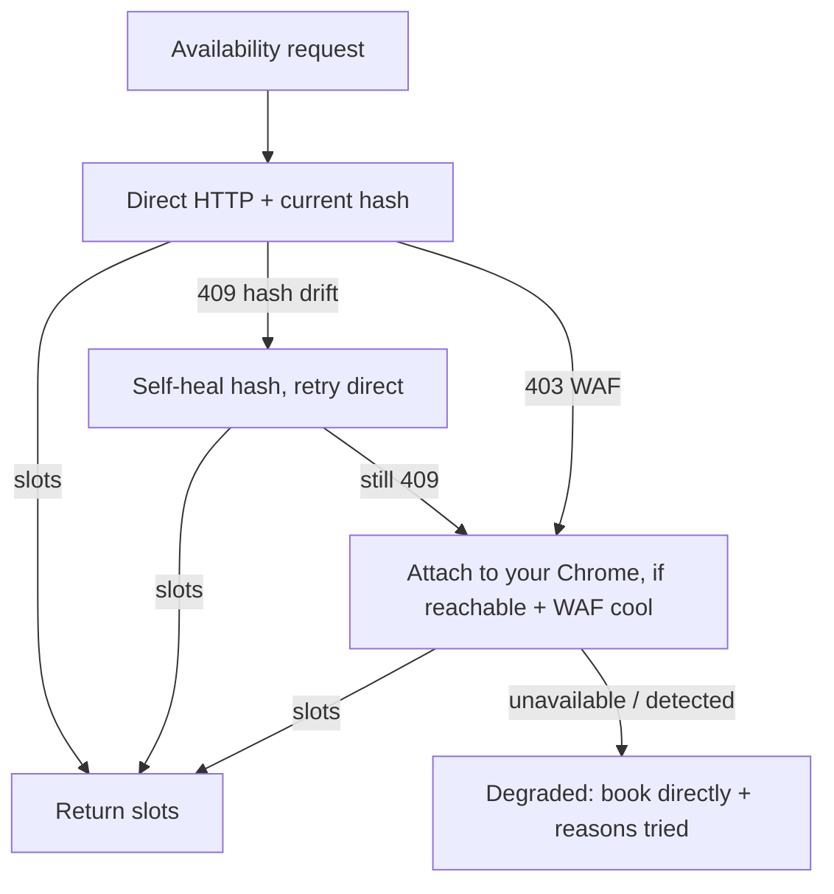

# OpenTable Availability Reliability

## Summary

Make OpenTable live availability return slots in a fork of `table-reservation-goat`. The primary fix is self-healing the stale-hash 409 by scraping and caching a fresh `RestaurantsAvailability` persisted-query hash on failure — a 2026-07-06 spike showed the direct HTTP path reaches OpenTable's gateway at human pace and fails only on the stale hash, so a fresh hash makes the direct path work without any browser. A secondary change routes the 409 (not just the 403) to the existing Chrome fallback, and keeps attach-to-your-Chrome as an optional, paced escape hatch for the WAF-blocked case. The spike killed the CLI-managed-Chrome idea: a CLI-launched browser is detected by Akamai whether headful or headless.

---

## Spike Findings (2026-07-06)

A headful-spawn spike, run against live OpenTable through the fork's own `ChromeAvailability` path, resolved the open rung-2 question and reshaped the design:

- **Rung 2 (CLI-launched headful Chrome): dropped.** A fresh-profile CLI-spawned Chrome is 403'd by Akamai exactly as headless is — headful does not help. Detection is on the automation/session fingerprint, not the headless flag.
- **Rung 3 (attach to a user's real Chrome): works only while the WAF is cool.** The first attach call returned a real 200 and parsed slots; after a few rapid calls Akamai escalated and 403'd even the real attached browser. It is a best-effort escape hatch, not a robust auto-rung.
- **The direct path fails cool-state on the hash, not the WAF.** At human pace the direct request reached the Apollo gateway and returned 409 (stale hash), not 403 (WAF). A fresh hash alone makes the direct path succeed in the common case — this is why the 409 self-heal, not the browser, is the workhorse.
- **R7 (fire the fallback on 409, not only 403) verified.** With that one-line broadening, the 409 correctly routed into the Chrome fallback; without it, the 409 never reached any browser rung.

Consequence: the multi-rung ladder collapses to the 409 self-heal plus the already-shipped WAF mitigations (cache, adaptive limiter, stale-cache fallback), with the Chrome attach path as an optional, paced escape hatch. The requirements below are scoped to that.

---

## Problem Frame

OpenTable availability fails two distinct ways, and they are not the same problem.

The **409** is persisted-query hash drift. The client sends a SHA-256 hash instead of the query text; OpenTable's Apollo gateway maps it to a registered query. That hash rotates on frontend bundle releases. The hardcoded `RestaurantsAvailabilityHash` was captured May 2026 and has since drifted, so the gateway rejects it with a 409 — even though the request cleared the WAF. Live testing on 2026-07-06 hit this on both `availability check` and `earliest`.

The **403** is the Akamai WAF, already analyzed in the 2026-05-09 `ot-akamai-waf-resilience` brainstorm: a probabilistic rule keyed on `(IP, session, opname)` that blocks `RestaurantsAvailability` for non-real-browser traffic and escalates under rapid-fire calls. That prior work shipped a mitigation stack — disk cache, singleflight, adaptive limiter, two-attempt retry, stale-cache fallback, `HTTPS_PROXY` — so a human-pace user rarely escalates.

Two gaps remain after that prior work. First, nothing fixes the 409 — the `--refresh-hashes` escape hatch is referenced in code comments and error hints but was never built. Second, the WAF mitigation degrades to a "venue exists, book directly" message on a cold cache when Akamai blocks; the only reliable recovery is a real browser, and today that requires the user to manually launch Chrome with a debug port. The browser fallback also never engages on the error we hit most, because it is gated on 403 bot-detection and the live failure is a 409.

---

## Key Decisions

- **The 409 self-heal is the primary, standalone win.** It is genuinely unbuilt, aligned with the author's design, and delivers value even if all browser work slips. Sequence it first.
- **The direct HTTP path is the primary success path, not the browser.** The spike showed the direct request reaches OpenTable's gateway at human pace and fails only on the stale hash (409, not 403). Fixing the hash makes the direct path work in the common case; the browser is a narrow escape hatch for the actively-WAF-blocked state, where it is itself unreliable.
- **No CLI-managed or spawned Chrome.** The spike disproved the CLI-launched-headful bet (403 regardless), and the author's 2026-05-09 brainstorm already rejected a resident browser daemon as off-identity. The only browser path retained is attaching to a Chrome the user launched themselves — best-effort, not a guaranteed rung. This keeps the change upstream-friendly.
- **The attach fallback must be paced.** The spike escalated Akamai by firing browser navigations rapidly (a 14-day window = 14 back-to-back navigations), which 403'd even the real browser. Browser calls must reuse the existing cache and adaptive limiter, not fire per-day unthrottled.
- **Refreshing the hash must invalidate the availability cache.** The prior brainstorm flagged that cached responses are tied to a schema/hash version; a hash rotation that isn't paired with cache invalidation would serve responses shaped for the old query. The 409 self-heal and the existing cache are coupled.

---

## Requirements

**Hash self-heal (the 409)**

- R1. On a `RestaurantsAvailability` 409 (Apollo persisted-query mismatch) or a `PERSISTED_QUERY_NOT_FOUND` 400, the client fetches a fresh OpenTable page, extracts the current `RestaurantsAvailability` persisted-query hash, caches it, and retries the call once with the fresh hash.
- R2. The freshly scraped hash persists across invocations (so the scrape cost is paid once per rotation, not once per call) and takes precedence over the hardcoded constant when present.
- R3. A refreshed hash invalidates availability cache entries written under the prior hash, so no response shaped for the old query is served after a rotation.
- R4. A manual refresh entry point exists (e.g., `doctor --refresh-hashes` or equivalent) so a user can force a re-scrape without waiting for a failure.
- R5. If the scrape cannot find a hash, the CLI surfaces a clear, actionable error rather than looping or failing silently.

**WAF fallback (the 403), post-spike**

- R6. The availability path tries direct HTTP with the self-healed hash first (the common-case success path per the spike), then falls back to a user's already-running Chrome via the debug URL when direct is WAF-blocked. The CLI does not spawn its own Chrome for this — the spike proved a CLI-launched browser is 403'd regardless of headful/headless, so the spawn rung is dropped.
- R7. The browser fallback triggers on both the 403 bot-detection case and the 409 hash-drift case — not only on 403 as it does today. (Verified in the spike: without this, the 409 never reaches the fallback.)
- R8. The attach-to-your-Chrome path is a best-effort, paced escape hatch, not a guaranteed floor. It succeeds only while Akamai's score is cool; rapid-fire or multi-day-window calls escalate the WAF and 403 even the real browser, so browser calls reuse the existing cache and adaptive limiter rather than firing per day unthrottled.
- R9. When both direct and the attach fallback fail, the CLI returns the existing "venue exists, book directly" degraded response with a reason that names what was tried and why each failed.

**Behavior and surface**

- R10. `availability check` gets the same self-heal + fallback path as `earliest` — today only `earliest` reaches the Chrome fallback, so a direct `availability check` surfaces the raw 409.
- R11. The new behavior stays agent-safe: non-interactive, `--agent`/JSON output unchanged in shape, no new interactive prompt on the default path.

---

## Key Flows

- F1. Availability request with self-heal and paced fallback
  - **Trigger:** Any availability call (`availability check`, `earliest`, `goat` slot enrichment) for an OpenTable venue.
  - **Steps:** Try direct HTTP with the current hash. On 409, self-heal the hash (R1) and retry direct — this is the common-case success path. On a still-failing 409 or a 403, fall to the attach-to-your-Chrome escape hatch (only when a debug Chrome is reachable, subject to the cache/limiter). On total failure, return the degraded book-directly response naming what was tried.
  - **Outcome:** Slots from the direct path in the common case; slots from the attached browser when the WAF is cool and Chrome is available; a clear failure reason otherwise.
  - **Covered by:** R1, R6, R7, R8, R9, R10

---

## Acceptance Examples

- AE1. **Covers R1, R2.** Given the hardcoded hash is stale, when the user runs `availability check <id> --date <d> --party 2` and the gateway returns 409, the CLI scrapes a fresh hash, retries, and returns slot data. A second call within the same session reuses the persisted fresh hash and does not re-scrape.
- AE2. **Covers R3.** Given a cached availability response exists under the old hash, when a hash refresh occurs, the stale-hash cache entry is not served; the next read reflects the current query shape.
- AE3. **Covers R7, R10.** Given a direct `availability check` returns 409, the browser ladder engages (today it does not, because the fallback is 403-only and `availability check` never reaches it).
- AE4. **Covers R8.** Given direct HTTP is WAF-blocked, the WAF score is cool, and the user has Chrome running on the debug port, the CLI returns slots via the attach fallback. Given the same but Akamai has escalated, the attach fallback also 403s and the CLI degrades per R9.
- AE5. **Covers R9.** Given both direct and the attach fallback fail, the response names what was tried and its failure reason, not a generic error.

---

## Scope Boundaries

**Deferred for later**
- The upstream `/printing-press-amend` PR. Fork-first; sharing is a later decision. The 409 self-heal + R7 are upstream-friendly (they match the author's design); package them for upstream once proven locally.
- Booking/cancel hash refresh. The same scrape machinery could refresh the stale `BookingConfirmationHash`/`CancelReservationHash`, but this brainstorm is scoped to availability reads. Note it as adjacent follow-on.

**Outside this scope**
- Rebuilding the 403 mitigation stack. The cache, singleflight, adaptive limiter, retry, stale-cache fallback, and `HTTPS_PROXY` already exist from the 2026-05-09 work; this builds on them, it does not replace them.
- Resy and Tock paths. Both already return live availability and booking; untouched.
- Any CLI-spawned or CLI-managed browser. The spike disproved the headful-spawn bet (403 regardless), and a resident daemon is off-identity per the prior brainstorm. Only user-launched-Chrome attach is retained. Chasing stealthier spawn is explicitly not pursued.

---

## Dependencies / Assumptions

- The SSR extraction path (`FetchInitialState` in `internal/source/opentable/ssr.go`) can reach the page markup that carries the current `RestaurantsAvailability` hash. Assumption — the exact location of the hash in the current bundle must be confirmed during the spike; if it is not in `__INITIAL_STATE__`, the scrape needs a different anchor.
- A CLI-launched headful Chrome does NOT pass Akamai — disproven by the 2026-07-06 spike (403 regardless of headful/headless). The spawn rung is dropped; only attach-to-existing-Chrome works, and only while the WAF is cool.
- The existing availability cache is keyed such that a hash-version dimension can be added for R3. Confirm against `internal/source/opentable/avail_cache.go`.
- `BotDetectionError` / `IsBotDetection` remain the signal for the 403 branch; R7 adds a 409 branch alongside it rather than reclassifying the 409 as bot-detection.

---

## Outstanding Questions

### Resolved by the 2026-07-06 spike
- Does a CLI-launched Chrome pass Akamai? No — 403 regardless of headful/headless. The spawn rung is dropped; the plan builds the 409 self-heal + R7 + attach-as-escape-hatch, not a multi-rung ladder.

### Deferred to Planning
- [Affects R2, R4] Where does the refreshed hash persist and under what config surface — reuse the session/config file, or a dedicated hash cache? Pick names consistent with the existing `TABLE_RESERVATION_GOAT_OT_*` and `TRG_*` conventions.
- [Affects R2] How is a scraped hash decided to be current vs itself stale — trust the freshly scraped value unconditionally, or validate with a probe call before persisting?
- [Affects R8] Should browser fallback calls share the existing availability cache/limiter keys, and should a multi-day window cap the number of browser navigations to avoid self-escalating the WAF? The spike showed a 14-day loop hammering the browser triggers escalation.

---

## Sources / Research

- `docs/brainstorms/2026-05-09-ot-akamai-waf-resilience-requirements.md` — the author's prior WAF analysis and the shipped mitigation stack; the no-daemon identity decision lives here.
- `internal/source/opentable/client.go` — `RestaurantsAvailabilityHash` constant (~line 63), the 409/persisted-query error surfacing (~lines 685-810), `gqlCall`, and `RefreshAkamaiCookies` usage (~line 111).
- `internal/source/opentable/chrome_avail.go` — the Chrome-page-XHR interception path and the documented finding that spawned headless is detected while attached real Chrome passes.
- `internal/source/opentable/cooldown.go` — `BotDetectionError`, `BotKindOperationBlocked`, and the operation-specific vs session-wide distinction.
- `internal/source/opentable/ssr.go` — `FetchInitialState`, the SSR extraction machinery the hash scrape would reuse.
- `internal/cli/earliest.go` — the `IsBotDetection`-gated Chrome fallback (~line 788) that R7 extends to fire on 409.
