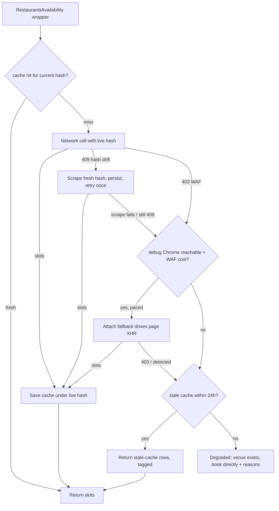

# fix: OpenTable Availability Reliability

**Target repo:** `printing-press-library` fork (`ganes-j`), branch `opentable-availability-reliability`. All paths below are relative to the CLI root `library/food-and-dining/table-reservation-goat/`.

## Summary

Make OpenTable live availability return slots by self-healing the stale persisted-query hash: on a 409, scrape a fresh `RestaurantsAvailability` hash, persist it, and retry the direct call. A secondary change fires the existing browser fallback on the 409 (not only the 403), pushes that fallback down into the client so both `earliest` and `availability check` inherit it, and paces it so a wide window doesn't self-escalate Akamai. No CLI-spawned browser — the spike proved it is 403'd regardless (see origin: `docs/brainstorms/2026-07-06-opentable-availability-reliability-requirements.md`, Spike Findings).

---

## Problem Frame

OpenTable availability fails two ways. The **409** is persisted-query hash drift: the hardcoded `RestaurantsAvailabilityHash` (captured May 2026) no longer matches OpenTable's registered query, so the Apollo gateway rejects it — even though the request cleared the WAF. The **403** is the Akamai WAF, already mitigated by the shipped cache/limiter/stale-fallback stack from the 2026-05-09 work.

The 2026-07-06 spike established the decisive fact: at human pace the direct request reaches the gateway and returns 409, not 403. So the stale hash — not the WAF — is what breaks the common case, and a fresh hash makes the direct path succeed without any browser. The spike also disproved the CLI-spawned-Chrome idea (403 regardless of headful/headless) and showed the attach path works only while the WAF is cool, escalating under rapid-fire multi-day loops.

Today `availability check` surfaces the raw 409, and the `earliest` browser fallback never engages on a 409 because it is gated on 403 bot-detection.

---

## Key Technical Decisions

- **KTD1. Self-heal and browser fallback live in the client availability wrapper, not per-CLI-command.** `RestaurantsAvailability` in `internal/source/opentable/client.go` is the single choke point both `earliest` and `availability check` already call. Placing the 409 self-heal and the browser fallback there satisfies R10 (parity) with no duplication, versus wiring each command separately. (see origin: Key Decisions)
- **KTD2. The scraped hash persists in a dedicated on-disk cache file, not `config.toml`.** Mirror the existing on-disk-state convention (`cooldown.go`, `avail_cache.go` both persist under `os.UserCacheDir()/table-reservation-goat-pp-cli/`). Keeps the user-facing `config.toml` clean and matches how the CLI already stores derived runtime state.
- **KTD3. A freshly scraped hash is trusted without a probe call.** Correctness is self-correcting: if a scraped hash is itself stale, the next availability call 409s and re-triggers the refresh. A validating probe call would add a round-trip and WAF exposure for no durable benefit.
- **KTD4. No CLI-spawned or CLI-managed browser.** Spike-disproven (403 regardless). The retained browser path is attach-to-a-user-launched-Chrome only, as a best-effort escape hatch. The existing spawn scaffold in `chrome_avail.go` stays for its actionable error message but is not promoted to a rung.
- **KTD5. R3 (cache invalidation on hash change) rides on existing behavior.** `loadAvailCache(key, currentHash)` already misses when the stored entry's hash differs from `currentHash`, and `saveAvailCache` stamps the current hash. Threading the live (possibly-refreshed) hash through those calls invalidates stale-hash entries for free — no new mechanism.

---

## High-Level Technical Design

The availability wrapper's decision path after this change:

Directional, not implementation specification. The cache/limiter/singleflight envelope around this path already exists; the new elements are the 409→scrape→retry branch and the relocated, paced attach fallback.

---

## Requirements Traceability

- R1 (409 self-heal) → U2, U3
- R2 (persist fresh hash) → U1
- R3 (cache invalidation on hash change) → U3 (rides on existing cache, KTD5)
- R4 (manual refresh entry point) → U6
- R5 (clear error when scrape finds no hash) → U2
- R6 (direct-first, attach fallback, no spawn) → U4
- R7 (fire fallback on 409, not only 403) → U4
- R8 (paced, cached attach fallback) → U5
- R9 (degraded response names what was tried) → U6
- R10 (`availability check` parity) → U4 (via KTD1)
- R11 (agent-safe, no new default prompt) → verified across U4, U6

---

## Implementation Units

### U1. Overridable availability hash with on-disk persistence

- **Goal:** Replace direct use of the `RestaurantsAvailabilityHash` const with a resolved value that defaults to the const but can be overridden by a persisted, scraped hash.
- **Requirements:** R2
- **Dependencies:** none
- **Files:** `internal/source/opentable/hash_store.go` (new), `internal/source/opentable/hash_store_test.go` (new), `internal/source/opentable/client.go` (read the resolved hash at construction)
- **Approach:** A small store that loads a persisted hash from a dedicated cache file under `os.UserCacheDir()/table-reservation-goat-pp-cli/` (mirror `cooldown.go`'s path + best-effort read/write; a corrupt or absent file falls back to the const, never crashes — KTD2). Expose a getter the availability path uses instead of the bare const, and a setter the refresh path (U2) calls on success. Optional env override for the cache path consistent with existing `TABLE_RESERVATION_GOAT_OT_*` / `TRG_OT_*` naming.
- **Patterns to follow:** `internal/source/opentable/cooldown.go` (disk-persisted state, best-effort read/write), `avail_cache.go` (cache-dir path construction).
- **Test scenarios:**
  - Round-trip: setter writes a hash, a fresh loader reads the same value back.
  - Absent file: loader returns the const default, no error.
  - Corrupt file: loader falls back to the const default, no panic.
  - `Test expectation:` unit-level, no network.

### U2. Scrape a fresh RestaurantsAvailability hash from OpenTable

- **Goal:** Fetch an OpenTable page through the existing Surf transport and extract the current `RestaurantsAvailability` persisted-query hash; persist it via U1.
- **Requirements:** R1, R5
- **Dependencies:** U1
- **Files:** `internal/source/opentable/hash_refresh.go` (new), `internal/source/opentable/hash_refresh_test.go` (new), `internal/source/opentable/testdata/` (captured page/bundle fixture)
- **Approach:** Reuse the Surf-backed fetch path (the same transport `ssr.go`'s `FetchInitialState` uses, which clears Akamai for reads). Extract the hash for the `RestaurantsAvailability` operation, then persist through U1's setter. On no-match, return a clear, actionable error (R5) rather than looping or writing an empty hash.
- **Execution note:** The exact location of the hash in OpenTable's current bundle is an execution-time discovery — the hash may live in a JS chunk rather than the SSR HTML. Start by capturing a live page (and, if needed, its referenced JS bundle) as a `testdata/` fixture, locate the sha256 for the operation, and anchor the parser on that. Write the parser test against the fixture first.
- **Patterns to follow:** `internal/source/opentable/ssr.go` (`FetchInitialState`, regex/anchor extraction from OT markup), `client.go` Surf client construction.
- **Test scenarios:**
  - Parser extracts the correct 64-hex hash from the captured fixture.
  - Fixture with no matching operation → returns the typed "no hash found" error, persists nothing.
  - On success, the persisted store (U1) reflects the scraped value.
  - `Covers R5.` Malformed page body → actionable error, no crash.
  - `Test expectation:` unit-level against fixture; no live network in tests.

### U3. Self-heal the 409 in the availability wrapper

- **Goal:** On a 409 / persisted-query error from the network call, refresh the hash (U2) and retry the direct call once with the fresh hash; thread the live hash through the cache calls.
- **Requirements:** R1, R3
- **Dependencies:** U1, U2
- **Files:** `internal/source/opentable/client.go` (the `RestaurantsAvailability` singleflight body), `internal/source/opentable/client_avail_test.go`
- **Approach:** In the singleflight function, detect a 409/persisted-query error from `restaurantsAvailabilityNetwork` (string match on the existing `HTTP 409` / `PERSISTED` surfacing, or a typed error if cheap to add). Call `refreshAvailabilityHash`; on success retry the network call once. Replace the two `loadAvailCache(key, RestaurantsAvailabilityHash)` / `saveAvailCache(key, RestaurantsAvailabilityHash, resp)` const references with the resolved live hash (U1), so a refreshed hash both drives the retry and invalidates stale-hash cache entries (KTD5). Structure mirrors the existing 5s BotDetection retry already in this function.
- **Patterns to follow:** the existing BotDetection retry + stale-cache-fallback block in `RestaurantsAvailability` (`client.go`).
- **Test scenarios:**
  - Network returns 409 then succeeds after refresh → wrapper returns slots; refresh was invoked once.
  - Network 409s and refresh finds no hash → error surfaces (no infinite retry).
  - Cache invalidation: an entry stored under the old hash is not served after the hash refreshes (existing `loadAvailCache` hash-mismatch miss, exercised through the live hash).
  - Refresh is not invoked on a 403 (that path stays the BotDetection branch).
  - `Test expectation:` unit-level; stub the network + refresh seams as the existing avail tests do.

### U4. Relocate the browser fallback into the client and fire it on 409

- **Goal:** Move the attach-to-Chrome fallback from `earliest.go` into the client availability path so both `earliest` and `availability check` inherit it, trigger it on 409 (after self-heal fails) as well as 403, and drop the CLI-spawn rung.
- **Requirements:** R6, R7, R10
- **Dependencies:** U3
- **Files:** `internal/source/opentable/client.go` (or a shared fallback helper in the opentable package), `internal/cli/earliest.go` (call the shared path, remove the inline `IsBotDetection`-gated block), `internal/cli/availability_check.go` (call the same path), `internal/source/opentable/client_avail_test.go`
- **Approach:** Extract the fallback decision (currently `earliest.go` lines ~780-809) into the opentable package so it runs after U3's self-heal exhausts. Trigger conditions: 403 bot-detection OR a 409 that survived self-heal. Attach-only (`ChromeAvailability` in attach mode); do not spawn. Both CLI commands call the shared path, satisfying R10. Preserve the typed error wrapping (`%w` on the underlying error so `IsBotDetection` still unwraps downstream — the existing `earliest.go` comment flags this).
- **Patterns to follow:** existing `ChromeAvailability` call site in `earliest.go`; `chrome_avail.go` attach-vs-spawn logic (retain spawn only for its actionable error text, KTD4).
- **Test scenarios:**
  - A 409 that survives self-heal routes to the fallback (regression guard for the spike-fixed gate).
  - A 403 routes to the fallback (existing behavior preserved).
  - `availability check` reaches the fallback on a blocked venue (parity — today it does not).
  - The fallback does not spawn a browser when no debug Chrome is reachable; it returns the actionable "launch Chrome with --remote-debugging-port" error.
  - `Test expectation:` unit-level; stub the availability + fallback seams.

### U5. Pace the attach fallback

- **Goal:** Route fallback results through the availability cache and cap browser navigations per multi-day window so a wide `--within` does not self-escalate Akamai.
- **Requirements:** R8
- **Dependencies:** U4
- **Files:** `internal/source/opentable/client.go` (fallback path caching), `internal/cli/earliest.go` (per-window navigation cap), test files alongside
- **Approach:** Cache successful fallback responses in the same avail cache keyed by the live hash, so repeat queries within TTL skip the browser. Cap the number of distinct browser navigations a single multi-day `earliest` window fires (the spike escalated Akamai with a 14-day loop firing 14 back-to-back navigations); beyond the cap, degrade the remaining days rather than hammering. Reuse the existing `AdaptiveLimiter`.
- **Patterns to follow:** `avail_cache.go` (cache write on success), `RestaurantsAvailability` limiter/singleflight envelope.
- **Test scenarios:**
  - A repeat fallback query within TTL is served from cache, no second browser navigation.
  - A multi-day window beyond the navigation cap degrades the excess days with a reason rather than firing unbounded navigations.
  - `log`/reason surfaces when the cap truncated coverage (no silent truncation).
  - `Test expectation:` unit-level; assert navigation-count and cache interaction via seams.

### U6. Manual refresh entry point and degraded-response completeness

- **Goal:** Add a manual hash-refresh command so a user can force a re-scrape, and ensure the total-failure response names what was tried.
- **Requirements:** R4, R9
- **Dependencies:** U2, U4
- **Files:** `internal/cli/doctor.go` (or `internal/cli/root.go` — add a `--refresh-hashes` flag/subcommand consistent with the existing `doctor` shape), `internal/cli/*_test.go`, and the SKILL.md/README doc surfaces for the new flag
- **Approach:** R4 — a manual entry point (`doctor --refresh-hashes` or equivalent) that calls `refreshAvailabilityHash` and reports the outcome. If a new `--flag` is added, register it in `.github/scripts/verify-skill/verify_skill.py` `COMMON_FLAGS` only if it appears in SKILL.md install text; otherwise ensure it is declared on the command so `verify-skill` passes. R9 — confirm the degraded "venue exists, book directly" response enumerates the rungs tried (direct + self-heal + attach) and their failure reasons; extend the reason string if it does not. Record the code customization under `.printing-press-patches/` per repo convention.
- **Patterns to follow:** existing `doctor` command in `internal/cli/`; the current degraded-reason construction in `earliest.go` / the client.
- **Test scenarios:**
  - `Covers R4.` The manual refresh command invokes the scrape and reports success/failure.
  - `Covers R9.` A fully-blocked venue returns a reason naming direct + self-heal + attach outcomes, not a generic error.
  - `verify_skill.py` passes for any new flag documented in SKILL.md.
  - `Test expectation:` unit-level for the command; doc-consistency via `verify_skill.py`.

---

## Scope Boundaries

**In scope:** OpenTable availability reads via `availability check`, `earliest`, and the `goat`/`watch` paths that call the same client wrapper.

**Outside this scope:**
- Rebuilding the WAF mitigation stack (cache, singleflight, limiter, retry, stale-fallback, `HTTPS_PROXY`) — reused, not replaced.
- Resy and Tock paths — already working, untouched.
- Any CLI-spawned or CLI-managed browser — spike-disproven; attach-only retained.

**Deferred to Follow-Up Work:**
- Booking/cancel hash refresh. The U1/U2 machinery could refresh the stale `BookingConfirmationHash`/`CancelReservationHash`, but that is a separate flow.
- The upstream `/printing-press-amend` PR. The 409 self-heal + R7 are upstream-friendly; package them for upstream once proven locally.

---

## Risks & Dependencies

- **Scrape location is an execution-time unknown (U2).** If the current hash lives only in a minified JS chunk (not the SSR HTML), U2's fetch must reach that chunk. Mitigation: capture a live fixture first, anchor the parser on the real location, and keep U2's failure path clean (R5) so a scrape miss degrades rather than crashes.
- **Self-heal escalation loop.** A refresh that itself fails could, if mis-structured, retry unbounded. Mitigation: refresh-and-retry-once only (U3); a second failure surfaces the error.
- **`api-service.ts` / eslint-autofix hazards do not apply** (Go codebase), but repo conventions do: record code customizations under `.printing-press-patches/`, do not touch generated `registry.json` / `cli-skills/` mirrors, and run `verify_skill.py` + `go build/vet/test` before any PR (per the CLI's AGENTS.md preflight).

---

## Verification

- `go build ./...`, `go vet ./...`, `go test ./...` from the CLI root pass.
- `python3 .github/scripts/verify-skill/verify_skill.py --dir library/food-and-dining/table-reservation-goat/` passes (from repo root) for any new flag.
- Runtime smoke (manual, not a unit test): with the fork binary and no debug Chrome, `availability check <id> --date <near> --party 2 --agent` returns slots (or a clean "no slots") at human pace instead of a raw 409 — the load-bearing behavioral check that the self-heal works end-to-end. Note: subject to Akamai cool-state per the spike; run once, not in a loop.

---

## Sources & Research

- `docs/brainstorms/2026-07-06-opentable-availability-reliability-requirements.md` — origin requirements + Spike Findings.
- `docs/brainstorms/2026-05-09-ot-akamai-waf-resilience-requirements.md` — prior WAF mitigation design (the reused stack).
- `internal/source/opentable/client.go` — `RestaurantsAvailability` wrapper (self-heal insertion point, ~line 507), `RestaurantsAvailabilityHash` const (~line 63), `gqlCall` 409 surfacing (~line 800).
- `internal/source/opentable/avail_cache.go` — hash-keyed cache (`loadAvailCache` mismatch-miss at ~line 176), confirming KTD5.
- `internal/source/opentable/ssr.go` — `FetchInitialState` Surf-backed extraction, the pattern U2 reuses.
- `internal/source/opentable/cooldown.go` — disk-persisted-state pattern for U1.
- `internal/cli/earliest.go` — the `IsBotDetection`-gated fallback (~line 786) that U4 relocates and R7 broadens.
- `internal/config/config.go`, `internal/source/auth/auth.go` — persistence surfaces considered for KTD2.
